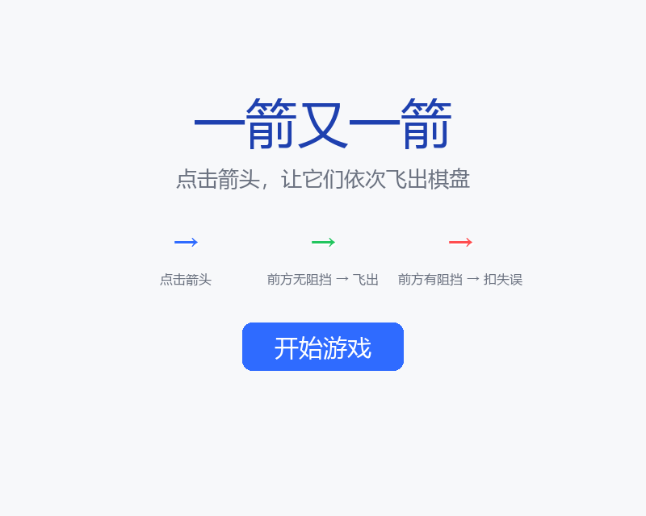
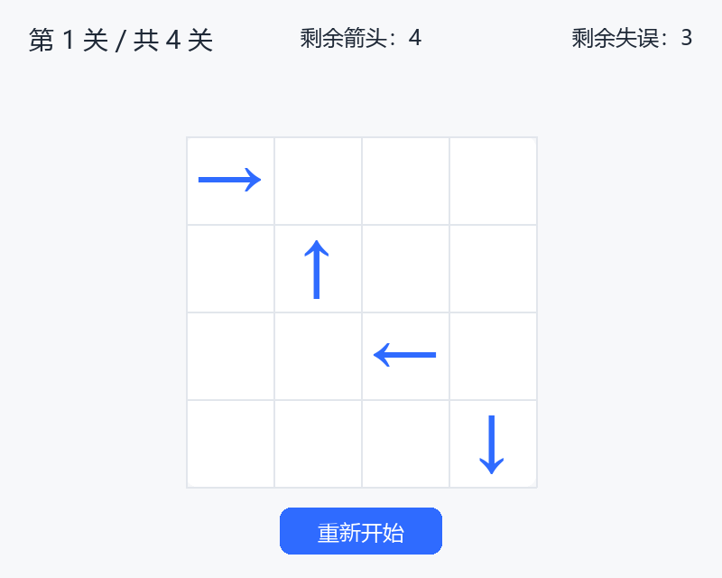
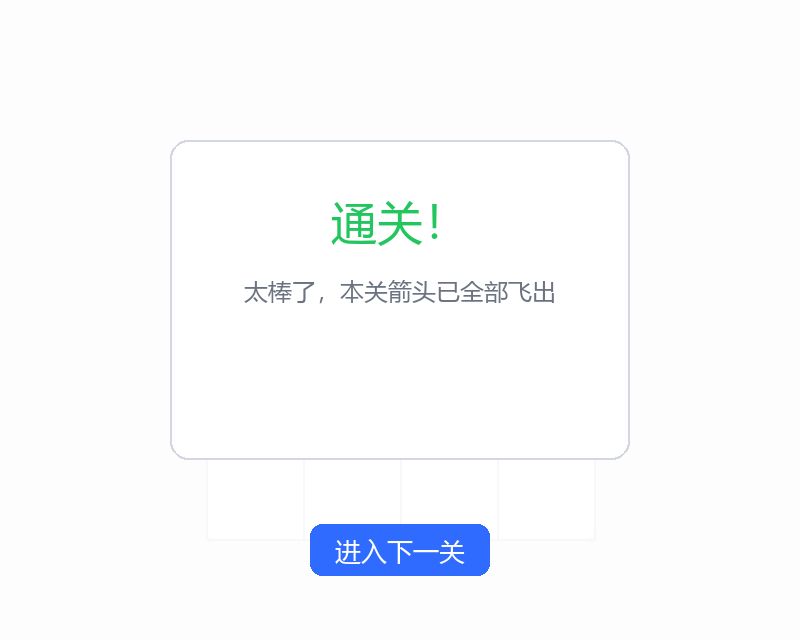
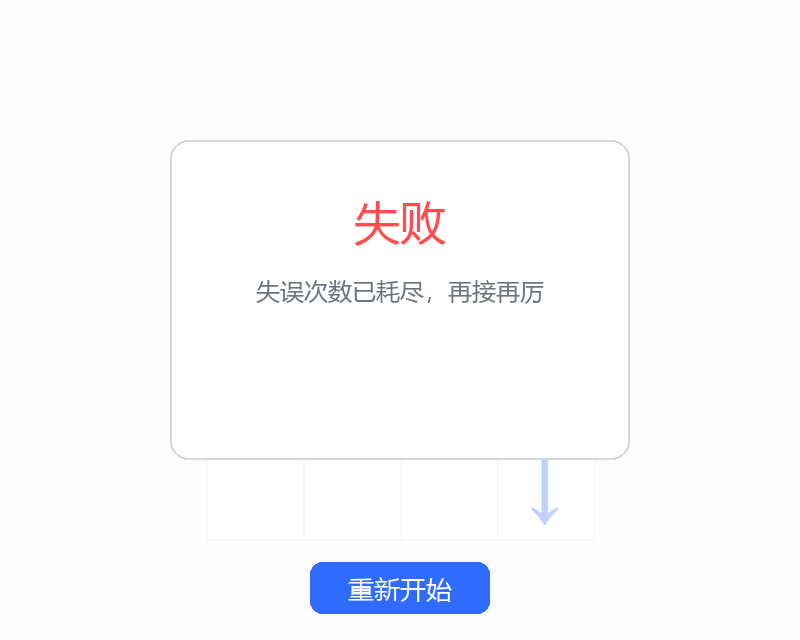

# 一箭又一箭（Arrow Puzzle）

基于 **Python + Pygame** 实现的点击式箭头解谜小游戏。棋盘上有若干带方向的箭头，按合适的顺序点击，让所有箭头依次飞出棋盘即可通关；点错顺序会被阻挡并消耗失误机会。

> 本项目为课程作业，开发过程借助 AIGC 工具（WorkBuddy / Claude）辅助完成，具体协作记录见项目博客。

## 游戏截图

### 开始界面


### 游戏界面


### 通关界面


### 失败界面


## 游戏规则

1. 棋盘中包含上、下、左、右四种方向的箭头；
2. 点击某个箭头后，程序检查该箭头前进方向上的路径：
   - 前方与棋盘边界之间**没有**其他箭头 → 该箭头飞出棋盘并消除；
   - 前方**有**其他箭头阻挡 → 箭头晃动变红提示碰撞，并消耗一次失误机会；
3. 清除本关全部箭头后进入下一关；
4. 失误次数耗尽时本关失败，可重新开始。

例如：`→ · · ↑ ·` 中第一个箭头朝右但右侧仍有箭头，不能飞出；`↑ · · · →` 中最后的箭头朝右右侧为空，可以飞出。

## 开发环境

| 项目 | 版本/说明 |
| ---- | ---- |
| 操作系统 | Windows 10 / 11 |
| Python | 3.13 |
| 图形库 | Pygame 2.6.1 |
| IDE | 任意 Python 编辑器（VS Code / PyCharm 等） |
| AIGC 辅助 | WorkBuddy（Claude） |

## 安装和运行方法

```bash
# 1. 克隆仓库
git clone <你的仓库地址>
cd arrow-puzzle

# 2. （可选）创建虚拟环境
python -m venv venv
venv\Scripts\activate        # Windows
source venv/bin/activate     # Linux / macOS

# 3. 安装依赖
pip install -r requirements.txt

# 4. 运行游戏
python main.py
```

## 游戏操作说明

- **鼠标左键**点击棋盘上的箭头进行操作；
- **开始界面**：点击「开始游戏」进入第 1 关；
- **游戏界面**：
  - 顶部显示当前关卡、剩余箭头数量、剩余失误次数；
  - 点击前方无阻挡的箭头，其飞出棋盘（绿色飞出动画）；
  - 点击被阻挡的箭头，其晃动变红提示，并扣除 1 次失误；
  - 点击「重新开始」按钮可将本关恢复到初始状态；
- **通关界面**：清空全部箭头后显示「通关！」，点击「进入下一关」继续；
- **失败界面**：失误次数耗尽后显示「失败」，点击「重新开始」重试本关。

## 项目结构

```
├── main.py              # 程序入口
├── game/
│   ├── core.py          # 核心逻辑：箭头模型、四方向路径检测、关卡解析与求解
│   ├── levels.py        # 关卡数据定义与可解性验证
│   └── ui.py            # Pygame 界面渲染、交互与动画
├── tests/
│   └── test_game.py     # 自动化测试（覆盖 T01~T06）
├── scripts/
│   └── capture.py       # 界面截图生成脚本
├── assets/screenshots/  # 游戏截图
├── requirements.txt     # 依赖清单
└── README.md
```

## 运行测试

```bash
python -m unittest discover -s tests -v
```

测试覆盖：路径检测（四方向）、边界越界处理、四个关卡可通关性、点击飞出、碰撞扣失误、失误耗尽失败、重新开始恢复等场景。
